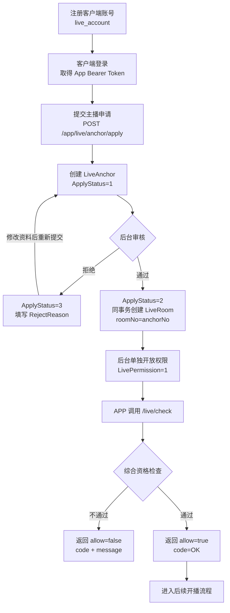

# 主播身份、申请、开播与问题排查说明

## `live_anchor` 表字段总览（先读）

`live_anchor` 一共包含 55 个数据库字段。下表以当前 `LiveAnchor` Model 和 APP/ADMIN 响应 DTO 为准；Model 上存在 JSON 标签不代表客户端一定可以看到该字段，接口实际只返回 DTO 白名单中的字段。

可见范围说明：

- **APP 本人**：登录主播通过 `/api/v1/app/live/anchor/info` 等本人接口查看；
- **APP 公开**：其他客户端通过 `/api/v1/app/live/anchor/detail?anchorNo=...` 查看公开主页；
- **后台**：管理后台主播列表或详情可见；
- **内部**：只用于数据库或服务端逻辑，不直接返回 APP。

### 公共主键和时间字段

| 数据库字段 | Go 字段 / 接口字段 | 类型 / 默认值 | 解释 | 可见范围 |
|---|---|---|---|---|
| `id` | `ID` / 后台 `id` | `uint`，自增主键 | `live_anchor` 的内部数据库主键，用于表关联和后台精确操作；客户端不得使用或看到该值 | 后台、内部 |
| `created_at` | `CreatedAt` / `createdAt` | `datetime`，GORM 创建时写入 | 主播记录首次创建时间，不等同于主播提交申请的业务时间 | 后台、内部 |
| `updated_at` | `UpdatedAt` / `updatedAt` | `datetime`，GORM 更新时写入 | 该记录最近一次被更新的时间 | 后台、内部 |
| `deleted_at` | `DeletedAt` | 可空 `datetime`，默认 `NULL` | GORM 软删除时间；非空时普通查询默认不返回该记录 | 内部 |

### 身份关联字段

| 数据库字段 | Go 字段 / JSON 字段 | 类型 / 默认值 | 解释 | 可见范围 |
|---|---|---|---|---|
| `user_id` | `UserId` / `userId` | `bigint unsigned`，必填、唯一 | 关联 `live_account.id`，保证一个客户端账号最多只有一条主播记录 | 后台、内部 |
| `anchor_no` | `AnchorNo` / `anchorNo` | `varchar(32)`，必填、唯一 | 主播对外编号，用于客户端展示、公开详情、搜索和客服查询；用于代替对外暴露主键 `id` | APP 本人、APP 公开、后台 |

### 公开资料和地区字段

| 数据库字段 | Go 字段 / JSON 字段 | 类型 / 默认值 | 解释 | 可见范围 |
|---|---|---|---|---|
| `nickname` | `Nickname` / `nickname` | `varchar(64)`，默认 `''` | 主播昵称；与客户端账号昵称相互独立 | APP 本人、APP 公开、后台 |
| `avatar` | `Avatar` / `avatar` | `varchar(500)`，默认 `''` | 主播头像 URL | APP 本人、APP 公开、后台 |
| `cover` | `Cover` / `cover` | `varchar(500)`，默认 `''` | 主播主页封面或背景图 URL | APP 本人、APP 公开、后台 |
| `signature` | `Signature` / `signature` | `varchar(255)`，默认 `''` | 主播签名或简介 | APP 本人、APP 公开、后台 |
| `gender` | `Gender` / `gender` | `tinyint unsigned`，默认 `0` | 性别：`0`未知、`1`男、`2`女、`3`其他 | APP 本人、APP 公开、后台 |
| `birthday` | `Birthday` / `birthday` | 可空 `date`，默认 `NULL` | 主播生日，格式 `YYYY-MM-DD`；公开主页不返回，避免泄露完整生日 | APP 本人、后台 |
| `country_code` | `CountryCode` / `countryCode` | `char(2)`，默认 `''` | ISO 3166-1 alpha-2 国家/地区代码，例如 `CN`、`MY`、`TH` | APP 本人、APP 公开、后台 |
| `region_code` | `RegionCode` / `regionCode` | `varchar(32)`，默认 `''` | 省、州或地区编码 | APP 本人、APP 公开、后台 |
| `city_code` | `CityCode` / `cityCode` | `varchar(32)`，默认 `''` | 城市编码 | APP 本人、APP 公开、后台 |
| `language` | `Language` / `language` | `varchar(16)`，默认 `''` | 主播主要语言，例如 `zh-CN`、`en-US`、`ms-MY` | APP 本人、APP 公开、后台 |

### 类型、分类和标签字段

| 数据库字段 | Go 字段 / JSON 字段 | 类型 / 默认值 | 解释 | 可见范围 |
|---|---|---|---|---|
| `anchor_type` | `AnchorType` / `anchorType` | `tinyint unsigned`，默认 `0` | 主播账号性质：`0`普通、`1`官方、`2`内部运营；不等于签约状态或公会身份 | APP 本人、APP 公开、后台 |
| `category_id` | `CategoryId` / `categoryId` | `bigint unsigned`，默认 `0` | 主播长期经营的主要直播分类 ID；`0` 表示未指定，非 `0` 必须来自启用的 `live_category`；不参与开播资格判断 | APP 本人、APP 公开、后台 |
| `level` | `Level` / `level` | `int unsigned`，默认 `1` | 主播等级快照；当前模块只保存和返回，尚未实现自动升级规则 | APP 本人、APP 公开、后台 |
| `tag_ids` | `TagIds` / `tagIds` | `json`，默认 `NULL` | 主播标签 ID 数组，例如 `[1,3,8]`；适合一名主播拥有多个标签 | APP 本人、APP 公开、后台 |

### 公会字段

| 数据库字段 | Go 字段 / JSON 字段 | 类型 / 默认值 | 解释 | 可见范围 |
|---|---|---|---|---|
| `agency_id` | `AgencyId` / `agencyId` | `bigint unsigned`，默认 `0` | 主播所属公会或机构 ID；`0` 表示无公会 | APP 本人、后台 |
| `agency_join_at` | `AgencyJoinAt` / `agencyJoinAt` | `bigint`，默认 `0` | 加入当前公会的时间，毫秒时间戳；`0` 表示未记录或无公会 | 后台、内部 |

### 申请和审核字段

| 数据库字段 | Go 字段 / JSON 字段 | 类型 / 默认值 | 解释 | 可见范围 |
|---|---|---|---|---|
| `apply_status` | `ApplyStatus` / `applyStatus` | `tinyint unsigned`，默认 `0` | 主播申请状态：`0`未申请、`1`审核中、`2`通过、`3`拒绝 | APP 本人、后台 |
| `apply_at` | `ApplyAt` / `applyAt` | `bigint`，默认 `0` | 最近一次提交主播申请的时间，毫秒时间戳 | APP 本人、后台 |
| `audit_at` | `AuditAt` / `auditAt` | `bigint`，默认 `0` | 最近一次后台审核的时间，毫秒时间戳 | APP 本人、后台 |
| `audit_user_id` | `AuditUserId` / `auditUserId` | `bigint unsigned`，默认 `0` | 执行最近一次审核的后台管理员 ID；客户端不可见 | 后台、内部 |
| `reject_reason` | `RejectReason` / `rejectReason` | `varchar(255)`，默认 `''` | 最近一次审核被拒绝的原因，供主播修改资料后重新申请 | APP 本人、后台 |

### 认证字段

| 数据库字段 | Go 字段 / JSON 字段 | 类型 / 默认值 | 解释 | 可见范围 |
|---|---|---|---|---|
| `cert_status` | `CertStatus` / `certStatus` | `tinyint unsigned`，默认 `0` | 认证状态：`0`未认证、`1`认证中、`2`已认证、`3`认证失败 | APP 本人、APP 公开、后台 |
| `cert_type` | `CertType` / `certType` | `tinyint unsigned`，默认 `0` | 认证类型：`0`无、`1`个人、`2`机构、`3`官方 | APP 本人、APP 公开、后台 |
| `cert_name` | `CertName` / `certName` | `varchar(64)`，默认 `''` | 认证展示名称，例如“官方主播”或“签约主播”；这是认证名称对应的数据库字段 | APP 本人、APP 公开、后台 |

### 主播账号状态字段

| 数据库字段 | Go 字段 / JSON 字段 | 类型 / 默认值 | 解释 | 可见范围 |
|---|---|---|---|---|
| `status` | `Status` / `status` | `tinyint unsigned`，默认 `1` | 主播账号状态：`0`禁用、`1`正常、`2`封禁、`3`注销；不是客户端账号本身的登录状态 | APP 本人、后台 |
| `status_reason` | `StatusReason` / `statusReason` | `varchar(255)`，默认 `''` | 状态变更原因，例如禁用或封禁原因 | APP 本人、后台 |
| `ban_until` | `BanUntil` / `banUntil` | `bigint`，默认 `0` | 临时封禁截止时间，毫秒时间戳；`0` 表示非临时封禁或永久封禁，需结合 `status` 判断 | APP 本人、后台 |

### 功能权限字段

| 数据库字段 | Go 字段 / JSON 字段 | 类型 / 默认值 | 解释 | 可见范围 |
|---|---|---|---|---|
| `live_permission` | `LivePermission` / `livePermission` | `tinyint unsigned`，默认 `0` | 开播权限：`0`禁止、`1`允许；审核通过不等于自动允许开播 | APP 本人、后台 |
| `pk_permission` | `PkPermission` / `pkPermission` | `tinyint unsigned`，默认 `0` | PK 权限：`0`禁止、`1`允许；允许 PK 前还必须通过完整开播资格检查 | APP 本人、后台 |
| `recommend_permission` | `RecommendPermission` / `recommendPermission` | `tinyint unsigned`，默认 `1` | 进入推荐系统的资格：`0`禁止、`1`允许；不代表一定被推荐 | APP 本人、后台 |
| `withdraw_permission` | `WithdrawPermission` / `withdrawPermission` | `tinyint unsigned`，默认 `0` | 主播运营侧提现权限：`0`禁止、`1`允许；最终能否提现仍由钱包和风控系统判断 | APP 本人、后台 |

### 签约和推荐运营字段

| 数据库字段 | Go 字段 / JSON 字段 | 类型 / 默认值 | 解释 | 可见范围 |
|---|---|---|---|---|
| `is_signed` | `IsSigned` / `isSigned` | `tinyint unsigned`，默认 `0` | 是否为签约主播：`0`否、`1`是 | APP 本人、APP 公开、后台 |
| `is_recommended` | `IsRecommended` / `isRecommended` | `tinyint unsigned`，默认 `0` | 是否被运营人工推荐：`0`否、`1`是；仍应结合推荐权限、账号状态等条件 | APP 公开、后台 |
| `newcomer_until` | `NewcomerUntil` / `newcomerUntil` | `bigint`，默认 `0` | 新人保护或新人推荐截止时间，毫秒时间戳；`0` 表示不在新人期 | 后台、内部 |
| `sort` | `Sort` / `sort` | `int`，默认 `0` | 人工排序权重，数值越大越靠前；仅是推荐排序候选因素 | 后台、内部 |
| `recommend_weight` | `RecommendWeight` / `recommendWeight` | `int`，默认 `0` | 推荐基础权重，预留给推荐算法使用；当前不等于最终排序结果 | 后台、内部 |

### 直播统计快照字段

| 数据库字段 | Go 字段 / JSON 字段 | 类型 / 默认值 | 解释 | 可见范围 |
|---|---|---|---|---|
| `fans_count` | `FansCount` / `fansCount` | `bigint unsigned`，默认 `0` | 粉丝数量缓存或快照，不是关注明细表 | APP 本人、APP 公开、后台 |
| `total_live_count` | `TotalLiveCount` / `totalLiveCount` | `bigint unsigned`，默认 `0` | 累计完成或记录的开播场次 | APP 本人、APP 公开、后台 |
| `total_live_duration_ms` | `TotalLiveDurationMs` / `totalLiveDurationMs` | `bigint unsigned`，默认 `0` | 已完成场次的累计逻辑直播时长，单位毫秒 | APP 本人、APP 公开、后台 |
| `max_online_count` | `MaxOnlineCount` / `maxOnlineCount` | `int unsigned`，默认 `0` | 历史单场最高在线人数 | APP 本人、APP 公开、后台 |
| `total_view_count` | `TotalViewCount` / `totalViewCount` | `bigint unsigned`，默认 `0` | 累计观看人次快照，不表示去重用户数 | APP 本人、APP 公开、后台 |
| `last_live_at` | `LastLiveAt` / `lastLiveAt` | `bigint`，默认 `0` | 最近一次开播时间，毫秒时间戳；`0` 表示尚未记录 | APP 本人、APP 公开、后台 |
| `last_live_end_at` | `LastLiveEndAt` / `lastLiveEndAt` | `bigint`，默认 `0` | 最近一次下播时间，毫秒时间戳；公开主页不返回 | APP 本人、后台 |

### 来源和渠道字段

| 数据库字段 | Go 字段 / JSON 字段 | 类型 / 默认值 | 解释 | 可见范围 |
|---|---|---|---|---|
| `source` | `Source` / `source` | `varchar(32)`，默认 `''` | 主播记录来源，例如 `app`、`admin`、`import`、`old_platform` | 后台、内部 |
| `source_id` | `SourceId` / `sourceId` | `varchar(64)`，默认 `''` | 第三方平台或旧系统中的主播 ID，用于迁移追踪和去重 | 后台、内部 |
| `channel_id` | `ChannelId` / `channelId` | `bigint unsigned`，默认 `0` | 首次注册或引入渠道 ID；APP 首次申请时必须大于 `0`，并参与生成 `anchor_no` | 后台、内部 |

### 风控、备注和扩展字段

| 数据库字段 | Go 字段 / JSON 字段 | 类型 / 默认值 | 解释 | 可见范围 |
|---|---|---|---|---|
| `risk_level` | `RiskLevel` / `riskLevel` | `tinyint unsigned`，默认 `0` | 风控等级：`0`正常、`1`低风险、`2`中风险、`3`高风险；高风险会影响开播资格 | 后台、内部 |
| `remark` | `Remark` / `remark` | `varchar(500)`，默认 `''` | 运营后台备注，前台不可见，不应存放需要向主播展示的原因 | 后台、内部 |
| `extra` | `Extra` / `extra` | 可空 `json`，默认 `NULL` | 低频扩展数据；不建议存放需要高频筛选、排序或建立索引的业务字段 | 后台、内部 |

> APP 只能通过主播申请和资料修改接口写入公开资料白名单，不能直接修改审核、认证、账号状态、权限、推荐、统计、来源、风控或后台备注字段。后台修改敏感字段时应使用对应的专用接口，不能直接把整行 Model 作为请求体保存。

## `live_room` 表字段总览（一个主播一个直播间）

`live_room` 保存直播间的长期配置和当前活动场次指针，不保存历史场次统计。APP 使用 `room_no`，内部主键 `id`、`anchor_id`、`current_session_id` 只在后台和服务端出现。

| 数据库字段 | 接口字段 | 类型 / 默认值 | 解释 | 可见范围 |
|---|---|---|---|---|
| `id` | 后台 `id` | `bigint unsigned`，自增主键 | 直播间内部关联主键，客户端不得使用或看到 | 后台、内部 |
| `created_at` | 后台 `createdAt` | `datetime` | 直播间记录创建时间 | 后台、内部 |
| `updated_at` | 后台 `updatedAt` | `datetime` | 直播间资料最近更新时间，不用于直播热度排序 | 后台、内部 |
| `deleted_at` | 无 | 可空 `datetime` | GORM 软删除时间 | 内部 |
| `room_no` | `roomNo` | `varchar(32)`，唯一 | 直播间对外编号；审核通过创建房间时默认等于 `live_anchor.anchor_no`，管理员可在后台修改；客户端路由、分享和查询使用 | APP、后台 |
| `anchor_id` | 后台 `anchorId` | `bigint unsigned`，唯一 | 关联 `live_anchor.id`，唯一约束保证一个主播一个直播间 | 后台、内部 |
| `category_id` | `categoryId` | `bigint unsigned`，默认 `0` | 当前直播间分类；开播时复制到场次快照，`0` 表示未分类 | APP、后台 |
| `title` | `title` | `varchar(128)` | 当前直播间标题 | APP、后台 |
| `cover_url` | `coverUrl` | `varchar(500)` | 当前直播间封面 URL | APP、后台 |
| `notice` | `notice` | `varchar(500)` | 直播间公告 | APP、后台 |
| `stream_name` | `streamName` | `varchar(64)`，唯一 | SRS 使用的稳定流名称；创建时默认等于主播编号，管理员修改 `room_no` 时不会联动修改它，它也不是直播场次 ID | 主播本人、后台、内部 |
| `publish_secret_hash` | 无 | `char(64)` | 本次推流凭证的 SHA-256 哈希；明文只在准备开播响应中返回一次 | 内部 |
| `stream_key_version` | `streamKeyVersion` | `int unsigned`，默认 `1` | 推流凭证轮换版本；每次准备新场次自动递增 | 主播本人、后台 |
| `status` | `status` | `tinyint unsigned`，默认 `1` | `0`后台/风控禁用，`1`正常，`2`主播主动关闭或运营停用 | 主播本人、后台 |
| `status_reason` | `statusReason` | `varchar(255)` | 禁用或关闭原因 | 主播本人、后台 |
| `status_changed_at` | 后台 `statusChangedAt` | `bigint` | 房间状态最近变更的毫秒时间戳 | 后台、内部 |
| `live_status` | `liveStatus` | `tinyint unsigned`，默认 `0` | `0`未开播、`1`准备中、`2`直播中、`3`结束中 | APP、后台 |
| `current_session_id` | 后台 `currentSessionId` | `bigint unsigned`，默认 `0` | 当前活动场次内部主键；客户端通过 `sessionNo` 识别场次 | 后台、内部 |
| `live_started_at` | `liveStartedAt` | `bigint`，默认 `0` | 当前场次首次成功推流时间；场次结束后清零 | APP、后台 |
| `visibility` | `visibility` | `tinyint unsigned`，默认 `1` | `0`私密、`1`公开、`2`仅关注者 | 主播本人、后台；公开列表只返回 `1` |
| `recommend_weight` | 后台 `recommendWeight` | `int`，默认 `0` | 后台直播间推荐排序权重，数值越大越靠前 | 后台、内部 |
| `extra` | 无 | 可空 `json` | 低频扩展配置，不应用于高频筛选 | 内部 |

## `live_session` 表字段总览（一场逻辑直播一条记录）

`live_session` 是直播历史和结算的事实表。OBS/SRS 在重连窗口内恢复时继续使用原场次，不新建记录。APP 使用 `session_no`，内部主键及关联 ID 仅在后台可见。

| 数据库字段 | 接口字段 | 类型 / 默认值 | 解释 | 可见范围 |
|---|---|---|---|---|
| `id` | 后台 `id` | `bigint unsigned`，自增主键 | 场次内部主键 | 后台、内部 |
| `created_at` | 后台 `createdAt` | `datetime` | 场次准备记录创建时间 | 后台、内部 |
| `updated_at` | 无 | `datetime` | 场次最近更新时间 | 内部 |
| `deleted_at` | 无 | 可空 `datetime` | GORM 软删除时间 | 内部 |
| `session_no` | `sessionNo` | `varchar(32)`，唯一 | 场次对外稳定编号 | APP、后台 |
| `room_id` | 后台 `roomId` | `bigint unsigned` | 关联 `live_room.id` | 后台、内部 |
| `anchor_id` | 后台 `anchorId` | `bigint unsigned` | 本场主播内部 ID 快照 | 后台、内部 |
| `category_id` | `categoryId` | `bigint unsigned` | 本场直播分类快照，后续修改房间分类不会改历史 | APP、后台 |
| `title` | `title` | `varchar(128)` | 本场标题快照 | APP、后台 |
| `cover_url` | `coverUrl` | `varchar(500)` | 本场封面快照 | APP、后台 |
| `status` | `status` | `tinyint unsigned` | `0`准备中、`1`直播中、`2`结束中、`3`已结束、`4`已取消、`5`失败 | APP、后台 |
| `active_room_id` | 无 | 生成列，可空、唯一 | 状态为 `0/1/2` 时生成 `room_id`，数据库兜底保证一个房间最多一个活动场次 | 内部 |
| `started_at` | `startedAt` | `bigint`，默认 `0` | 首次收到有效 `on_publish` 的毫秒时间戳 | APP、后台 |
| `ended_at` | `endedAt` | `bigint`，默认 `0` | 逻辑场次实际结束时间；断流超时时取最后一次 `on_unpublish` 时间 | APP、后台 |
| `duration_ms` | `durationMs` | `bigint unsigned`，默认 `0` | `ended_at - started_at`；包含成功重连前的短暂断流，不包含最终重连等待窗口 | APP、后台 |
| `last_unpublish_at` | `lastUnpublishAt` | `bigint`，默认 `0` | 最近一次 SRS 断流回调时间 | 主播本人、后台 |
| `reconnect_deadline_at` | `reconnectDeadlineAt` | `bigint`，默认 `0` | 等待 OBS/SRS 重连的截止时间；`0` 表示当前未等待 | 主播本人、后台 |
| `disconnect_count` | `disconnectCount` | `int unsigned`，默认 `0` | 本场有效断流次数；重复回调不会重复累计 | 主播本人、后台 |
| `end_reason` | `endReason` | `tinyint unsigned` | `0`未知、`1`主播结束、`2`管理员结束、`3`断流超时、`4`主播封禁/权限关闭、`5`系统异常 | 主播本人、后台 |
| `failure_reason` | `failureReason` | `varchar(500)` | 取消、强制结束或失败的详细原因 | 主播本人、后台 |
| `view_count` | `viewCount` | `bigint unsigned`，默认 `0` | 本场累计进入直播间次数 | APP、后台 |
| `viewer_count` | `viewerCount` | `bigint unsigned`，默认 `0` | 本场去重观看人数 | 主播本人、后台 |
| `peak_online_count` | `peakOnlineCount` | `int unsigned`，默认 `0` | 本场最高同时在线人数 | APP、后台 |
| `like_count` | `likeCount` | `bigint unsigned`，默认 `0` | 本场最终点赞次数 | APP、后台 |
| `gift_count` | `giftCount` | `bigint unsigned`，默认 `0` | 本场有效礼物总件数；不是礼物流水 | 主播本人、后台 |
| `gift_coin_amount` | `giftCoinAmount` | `bigint unsigned`，默认 `0` | 本场有效礼物金币总额；退款与结算以礼物/钱包账本为准 | 主播本人、后台 |
| `gift_user_count` | `giftUserCount` | `int unsigned`，默认 `0` | 本场去重送礼人数 | 主播本人、后台 |
| `stats_finalized_at` | `statsFinalizedAt` | `bigint`，默认 `0` | 本场统计完成最终汇总的毫秒时间戳 | 主播本人、后台 |
| `extra` | 无 | 可空 `json` | 场次低频扩展信息 | 内部 |

三张核心表的关系为：`live_anchor 1:1 live_room 1:N live_session`。主播聚合统计由已结算场次累加，历史真实时间与结果始终以 `live_session` 为准。

## 1. 文档目的

本文说明当前第一版 `LiveAnchor` 主播身份模块的真实行为，包括：

- 普通客户端账号如何申请成为主播；
- 后台如何审核主播申请；
- 审核通过后如何开放开播和 PK 权限；
- APP 在开播前会检查哪些字段；
- 主播被禁用、封禁、禁止开播或标记风险后如何排查；
- APP 和 ADMIN 分别可以通过哪些接口查看和修改主播状态。

本文中的字段名与后端 `LiveAnchor` Model 保持一致。所有接口统一返回：

```json
{
  "code": 0,
  "data": {},
  "msg": "成功"
}
```

其中业务失败通常表现为 `code != 0`，开播和 PK 资格检查还会在 `data` 中返回更具体的业务 `code`。

### 管理后台页面入口

管理后台登录后进入：

```text
直播管理 → 主播管理
直播管理 → 直播分类
直播管理 → 直播间管理
直播管理 → 直播场次
```

“主播管理”页面提供以下能力：

- 按 `anchorId`、`anchorNo`、`userId`、`nickname`、申请/认证/账号状态、主播类型、风险等级、开播权限、签约、推荐、公会、分类、渠道、来源和创建日期组合筛选；
- 查看公开资料、审核记录、封禁原因、四项功能权限、认证、运营推荐、签约、公会、风控、直播统计、来源和后台备注；
- 执行申请审核、禁用/恢复/临时或永久封禁/注销、功能权限、资料、认证、推荐、签约、公会、风险和备注修改；
- 对拒绝、禁用、封禁和注销等敏感操作进行二次确认，并在页面中提示关键字段联动约束。

超级管理员 `888` 在系统首次补建菜单时会获得初始菜单。当前后台已移除 Casbin API 权限系统，其他管理员角色只需要在“角色管理”中分配对应菜单；所有后台接口仍必须通过管理后台 JWT 校验。

---

## 2. 主播身份与客户端账号的关系

客户端账号保存在 `live_account`，主播身份保存在 `live_anchor`，二者通过以下字段关联：

| 字段 | 含义 |
|---|---|
| `LiveAccount.ID` | 客户端账号 ID，也是客户端 JWT 中的 `accountId` |
| `LiveAnchor.UserId` | 关联的客户端账号 ID |
| `LiveAnchor.ID` | 主播记录主键，仅用于服务端内部和管理后台 `anchorId` |
| `LiveAnchor.AnchorNo` | 主播对外编号，用于展示、搜索或客服查询 |

客户端主播接口的请求和响应均不出现 `LiveAnchor.ID` 或 `anchorId`。客户端识别、查询和展示主播统一使用 `AnchorNo`；管理后台仍可使用内部 `anchorId` 进行精确管理。

一个客户端账号最多只能有一条主播记录：

- `user_id` 有唯一索引 `uk_user_id`；
- `anchor_no` 有唯一索引 `uk_anchor_no`；
- APP 主播接口不接收客户端传入的 `userId`；
- 后端始终从客户端 JWT 读取 `accountId`，再查询 `live_anchor.user_id`。

客户端主播 JWT 只用于证明“当前用户是谁”。以下实时状态不会放进 JWT：

- `ApplyStatus`：申请状态；
- `Status`、`BanUntil`：主播账号和封禁状态；
- `RiskLevel`：风险等级；
- `LivePermission`、`PkPermission`：直播和 PK 权限；
- `CertStatus`：认证状态。

因此后台修改主播状态后，主播不需要重新登录，下一次 `/live/check` 或 `/pk/check` 会直接读取最新数据库状态。

---

## 3. 从注册申请到允许开播的完整流程



> 审核通过和创建唯一 `LiveRoom` 在同一个数据库事务内完成；创建失败时审核也会回滚。这里只创建固定直播间，不创建 `LiveSession`，也不签发推流凭证。主播身份模块负责资格判断；直播间与场次模块负责推流凭证、SRS 回调、断流重连和场次结算。当前实现没有创建 LiveKit Room。

### 3.1 注册客户端账号

接口：

```text
POST /api/v1/app/live/user/register
```

主要字段：

| 字段 | 说明 |
|---|---|
| `username` | 客户端登录名 |
| `password` | 客户端密码 |
| `nickname` | 客户端昵称，不等同于主播昵称 |
| `avatar` | 客户端头像，不等同于主播资料中的 `LiveAnchor.Avatar` |

客户端账号和管理后台 `sys_users` 是两套独立账号体系。

### 3.2 登录并取得客户端 Token

接口：

```text
POST /api/v1/app/live/user/login
```

成功后取得 `token`。调用主播 APP 私有接口时使用：

```http
Authorization: Bearer <客户端 token>
```

不要使用管理后台的 `x-token` 代替客户端 Token。

### 3.3 提交主播申请

接口：

```text
POST /api/v1/app/live/anchor/apply
```

申请资料示例：

```json
{
  "nickname": "Alice",
  "avatar": "https://example.com/avatar.png",
  "cover": "https://example.com/cover.png",
  "signature": "欢迎来到我的直播间",
  "gender": 2,
  "birthday": "1998-01-01",
  "countryCode": "MY",
  "regionCode": "10",
  "cityCode": "1001",
  "language": "ms-MY",
  "categoryId": 1,
  "tagIds": [1, 3, 8],
  "channelId": 1
}
```

字段说明：

| 字段 | 对应 Model 字段 | 说明 |
|---|---|---|
| `nickname` | `Nickname` | 主播昵称，必填，最长 64 字符 |
| `avatar` | `Avatar` | 主播头像 |
| `cover` | `Cover` | 主播主页封面 |
| `signature` | `Signature` | 主播简介，最长 255 字符 |
| `gender` | `Gender` | `0`未知、`1`男、`2`女、`3`其他 |
| `birthday` | `Birthday` | `YYYY-MM-DD`；`null` 表示未设置 |
| `countryCode` | `CountryCode` | ISO 3166-1 alpha-2，例如 `CN`、`MY` |
| `regionCode` | `RegionCode` | 省、州或地区编码 |
| `cityCode` | `CityCode` | 城市编码 |
| `language` | `Language` | 主要语言，例如 `zh-CN`、`ms-MY` |
| `categoryId` | `CategoryId` | 主要直播分类 ID，`0` 表示未指定 |
| `tagIds` | `TagIds` | 主播标签 ID 数组 |
| `channelId` | `ChannelId` | 首次注册/引入渠道 ID，必须大于 0 |

#### CategoryId（主播主要直播分类）

`CategoryId` 表示主播长期、主要经营的直播内容分类，例如游戏、音乐、聊天或电商等。它保存的是分类记录的 ID，不是分类名称：

| 项目 | 当前定义 |
|---|---|
| 数据库字段 | `live_anchor.category_id` |
| Go Model 字段 | `LiveAnchor.CategoryId` |
| JSON 字段 | `categoryId` |
| 数据类型 | `uint64` / MySQL `bigint unsigned` |
| 默认值 | `0`，表示尚未指定主要分类 |
| 字段归属 | 主播资料字段，不是审核状态或权限字段 |

当前版本中，该字段有以下实际用途：

- 主播申请时保存其主要内容分类；
- APP 的主播本人资料和公开主播资料会返回 `categoryId`，客户端可据此展示分类或选择分类名称；
- 主播可通过资料修改接口更新分类，也可以传 `0` 清空分类；
- 管理后台可以修改主播分类，并通过 `categoryId` 对主播列表进行精确筛选；
- `categoryId` 的统一数据源是 `live_category.id`，主播申请和资料更新会校验非 `0` 分类必须存在且已启用；
- 数据库建立了 `category_id + status` 联合索引，可用于后续按分类查询正常主播、分类频道和推荐候选主播。

它当前**不会**产生以下效果：

- 不决定主播申请是否审核通过；
- 不决定能否开播、PK、提现或进入推荐，开播资格仍由 `ApplyStatus`、`Status`、`BanUntil`、`RiskLevel` 和各项 Permission 字段共同决定；
- 不会因为后台审核通过而自动赋值；
- 不代表某一场直播实际选择的分类。当前开播时会把选择的分类写入 `live_room.category_id`，并复制到 `live_session.category_id` 作为历史快照；
- 与系统现有的“媒体库分类”无关，不能使用媒体库附件分类 ID 代替直播分类 ID。

直播分类现在由独立的 `live_category` 表维护：

| 字段 | 说明 |
|---|---|
| `id` | 分类 ID，也是主播 `categoryId` 的公开合法取值 |
| `parent_id` | 父分类 ID，`0` 表示顶级分类 |
| `code` | 稳定分类编码，只能使用小写字母、数字、下划线和短横线，创建后不可修改 |
| `name` | 分类展示名称；同一父分类下不能重名 |
| `icon` | 分类图标地址 |
| `sort` | 排序权重，数值越大越靠前 |
| `status` | `0`停用、`1`启用 |

客户端读取启用分类树：

```text
GET /api/v1/app/live/category/list
```

该接口无需登录，只返回启用分类。主播申请、APP 修改资料和后台修改主播资料时：

- `categoryId=0` 表示未分类或清空分类；
- `categoryId>0` 必须对应一条未删除且 `status=1` 的直播分类；
- 不存在或已停用的分类会返回“直播分类不存在”，不会保存无效 ID。

后台“直播管理 → 直播分类”支持分页筛选、查看分类树、新增、编辑、启停和删除。分类状态和删除规则为：

- 停用父分类会在同一事务中级联停用全部子孙分类；
- 启用子分类前，其全部上级分类必须已经启用；
- 修改父分类时禁止把分类移动到自身或子孙分类下面，避免循环；
- 只有已停用、没有子分类，且未被 `live_anchor.category_id` 或 `live_room.category_id` 引用的分类可以删除；历史 `live_session` 保存快照，不阻止删除；
- 直播分类与系统“媒体库分类”完全独立，不能混用 ID。

后台列表筛选示例：

```text
GET /api/v1/admin/live/anchor/list?page=1&pageSize=20&categoryId=1
```

该筛选是 `category_id = 1` 的精确匹配。当前接口只有在 `categoryId > 0` 时才添加筛选条件，因此不能使用 `categoryId=0` 筛选“未分类主播”；如需此能力，应单独扩展筛选参数或调整查询条件。

首次申请会初始化：

| 字段 | 初始值 | 说明 |
|---|---:|---|
| `ApplyStatus` | `1` | 进入审核中 |
| `ApplyAt` | 当前毫秒时间戳 | 本次申请时间 |
| `Status` | `1` | 主播账号状态正常 |
| `LivePermission` | `0` | 默认禁止开播 |
| `PkPermission` | `0` | 默认禁止 PK |
| `RecommendPermission` | `1` | 默认允许进入推荐系统 |
| `WithdrawPermission` | `0` | 默认禁止主播运营提现 |
| `CertStatus` | `0` | 未认证 |
| `RiskLevel` | `0` | 正常风险 |
| `Source` | `app` | 来源为 APP 申请 |

#### AnchorNo 生成规则

`AnchorNo` 使用：

```text
ChannelId + 六位序列(ID + 100000)
```

例如：

- `ChannelId=1`、主播记录 `ID=1` → `AnchorNo=1100001`；
- `ChannelId=2`、主播记录 `ID=4` → `AnchorNo=2100004`。

重新申请不会改变原来的 `AnchorNo` 或 `ChannelId`。

### 3.4 申请状态流转

`ApplyStatus` 定义：

| 值 | 常量 | 含义 | 是否可以再次申请 |
|---:|---|---|---|
| `0` | `AnchorApplyStatusNone` | 未申请 | 可以 |
| `1` | `AnchorApplyStatusPending` | 审核中 | 不可以，返回“主播申请正在审核中” |
| `2` | `AnchorApplyStatusApproved` | 已通过 | 不可以，返回“已经是主播” |
| `3` | `AnchorApplyStatusRejected` | 已拒绝 | 可以，复用原主播记录重新申请 |

被拒绝后重新申请会：

- 将 `ApplyStatus` 改回 `1`；
- 更新 `ApplyAt`；
- 清空 `AuditAt`；
- 清空 `AuditUserId`；
- 清空 `RejectReason`；
- 重新关闭 `LivePermission`、`PkPermission`、`WithdrawPermission`；
- 更新本次重新提交的公开资料；
- 保留原 `ID`、`UserId`、`AnchorNo`、`ChannelId`。

### 3.5 后台审核

审核接口：

```text
POST /api/v1/admin/live/anchor/audit
```

审核通过：

```json
{
  "anchorId": 1,
  "applyStatus": 2,
  "rejectReason": ""
}
```

审核拒绝：

```json
{
  "anchorId": 1,
  "applyStatus": 3,
  "rejectReason": "头像或资料不符合要求"
}
```

审核会维护：

| 字段 | 说明 |
|---|---|
| `ApplyStatus` | 目标审核结果，只能为 `2` 或 `3` |
| `AuditAt` | 审核时间，毫秒时间戳 |
| `AuditUserId` | 当前管理后台管理员 ID，从后台 JWT 获取 |
| `RejectReason` | 拒绝原因；拒绝时必填，通过时清空 |

审核通过还会在同一事务内创建该主播唯一的 `live_room`：初始 `room_no` 和 `stream_name` 都等于 `AnchorNo`，房间状态为正常、直播状态为未开播、当前场次为 `0`。管理员之后可以修改对外 `room_no`，但不会联动修改稳定的 `stream_name`。审核拒绝不会创建直播间。

启用自动迁移的环境会在启动时分批为“已审核通过但缺少直播间”的存量主播补建房间，重复执行不会创建第二个房间。生产环境若关闭自动迁移，应执行 `documents/live_room_session.sql` 中的补建 SQL。

只有 `ApplyStatus=1` 的记录可以审核。已经通过或拒绝的记录不能重复审核。

> 审核通过不会自动把 `LivePermission` 改成 `1`。审核结果和业务权限在第一版中明确分离。

### 3.6 后台开放直播权限

接口：

```text
POST /api/v1/admin/live/anchor/permission/update
```

示例：允许普通直播，但暂不允许 PK 和提现：

```json
{
  "anchorId": 1,
  "livePermission": 1,
  "pkPermission": 0,
  "recommendPermission": 1,
  "withdrawPermission": 0
}
```

四个权限字段必须完整传入：

| 字段 | `0` | `1` | 注意事项 |
|---|---|---|---|
| `LivePermission` | 禁止开播 | 允许开播 | 开播仍需通过其他状态检查 |
| `PkPermission` | 禁止 PK | 允许 PK | 开启 PK 时 `LivePermission` 必须为 `1` |
| `RecommendPermission` | 禁止进入推荐系统 | 允许进入推荐系统 | 不等于 `IsRecommended` |
| `WithdrawPermission` | 运营层禁止提现 | 运营层允许提现 | 钱包、KYC、风控仍需另行判断 |

不允许保存以下矛盾组合：

```text
LivePermission=0
PkPermission=1
```

### 3.7 APP 开播前检查

接口：

```text
GET /api/v1/app/live/anchor/live/check
```

后端按以下顺序实时检查：

1. 根据 JWT 的 `accountId` 查询 `LiveAnchor.UserId`；
2. 检查 `ApplyStatus == 2`；
3. 检查 `Status == 1`；
4. 如果是封禁状态，读取 `BanUntil`；
5. 检查 `RiskLevel` 是否允许直播；
6. 检查 `LivePermission == 1`；
7. 检查当前认证策略。

当前第一版认证不是开播硬条件，因此 `CertStatus != 2` 不会单独阻止开播。

允许开播：

```json
{
  "code": 0,
  "data": {
    "allow": true,
    "code": "OK",
    "message": ""
  },
  "msg": "成功"
}
```

禁止开播：

```json
{
  "code": 0,
  "data": {
    "allow": false,
    "code": "ANCHOR_BANNED",
    "message": "主播账号当前处于封禁状态",
    "banUntil": 1790000000000
  },
  "msg": "成功"
}
```

注意：外层 `code=0` 表示“资格检查接口执行成功”，是否允许开播应读取 `data.allow` 和 `data.code`。

### 3.8 从准备开播到场次结算

1. APP 调用 `POST /api/v1/app/live/room/session/prepare`，后端再次实时校验主播资格、房间状态和分类状态；
2. 后端创建 `status=0` 的 `live_session`，更新 `live_room.current_session_id`，并返回 `roomNo`、`sessionNo`、`streamName`、一次性 `publishToken`、`pushUrl` 和 `playUrl`；
3. OBS/SRS 开始推流，SRS 携带 `X-Live-Hook-Token` 调用 `POST /api/v1/app/live/hook/publish`，`param` 中带准备接口签发的 `token`；
4. 首次有效 `on_publish` 将场次改为直播中并写入 `started_at`；
5. SRS 调用 `on_unpublish` 时只写入 `last_unpublish_at` 和 `reconnect_deadline_at`，默认等待 20 秒，不立即结束；
6. 窗口内恢复推流时清空重连截止时间，继续原 `sessionNo`；迟到重连会被拒绝；
7. 超过窗口仍未恢复时，定时任务将场次置为结束中，`ended_at` 取最后断流时间；下一轮幂等结算后改为已结束；
8. 结算写入 `duration_ms`、`stats_finalized_at`，清理房间当前场次，并累加主播总场次、总时长、总观看和历史峰值。

主播主动结束、后台强制结束、主播封禁或关闭开播权限也会进入同一结束/结算链路。准备中尚未成功推流的场次直接变为已取消，不计入已完成直播统计。

---

## 4. 主播账号状态、封禁和禁止开播

### 4.1 Status 字段

`Status` 表示主播账号本身的状态：

| 值 | 常量 | 含义 | 是否能开播 |
|---:|---|---|---|
| `0` | `AnchorStatusDisabled` | 禁用 | 不能，返回 `ANCHOR_DISABLED` |
| `1` | `AnchorStatusNormal` | 正常 | 继续检查其他条件 |
| `2` | `AnchorStatusBanned` | 封禁 | 不能，返回 `ANCHOR_BANNED` |
| `3` | `AnchorStatusCancelled` | 注销 | 不能，返回 `ANCHOR_CANCELLED` |

相关字段：

| 字段 | 说明 |
|---|---|
| `Status` | 当前账号状态 |
| `StatusReason` | 禁用、封禁或注销原因 |
| `BanUntil` | 封禁截止时间，毫秒时间戳 |

修改状态接口：

```text
POST /api/v1/admin/live/anchor/status/update
```

### 4.2 禁用主播

```json
{
  "anchorId": 1,
  "status": 0,
  "statusReason": "账号资料异常，暂停使用",
  "banUntil": 0
}
```

保存结果：

- `Status=0`；
- `StatusReason` 保存禁用原因；
- `BanUntil=0`。

### 4.3 恢复正常

```json
{
  "anchorId": 1,
  "status": 1,
  "statusReason": "",
  "banUntil": 0
}
```

恢复正常会自动清空 `StatusReason` 和 `BanUntil`，但不会自动开启 `LivePermission` 或 `PkPermission`。

### 4.4 永久封禁

```json
{
  "anchorId": 1,
  "status": 2,
  "statusReason": "严重违规，永久封禁",
  "banUntil": 0
}
```

语义：

```text
Status=2 且 BanUntil=0
```

表示永久封禁。

### 4.5 临时封禁

```json
{
  "anchorId": 1,
  "status": 2,
  "statusReason": "违规直播，封禁七天",
  "banUntil": 1790000000000
}
```

临时封禁必须满足：

```text
Status=2
StatusReason 非空
BanUntil > 当前毫秒时间戳
```

当前第一版没有封禁到期自动恢复任务。即使 `BanUntil` 已经过期，只要 `Status` 仍为 `2`，`/live/check` 仍返回：

```text
code=ANCHOR_BANNED
message=主播封禁已到期，等待系统恢复账号状态
```

管理员需要调用 `/status/update` 把 `Status` 恢复为 `1`。

### 4.6 注销主播

```json
{
  "anchorId": 1,
  "status": 3,
  "statusReason": "主播主动注销",
  "banUntil": 0
}
```

注销不会删除 `live_anchor` 数据，会保留主播 ID、主播编号、历史直播统计和关联记录。

`Status=3` 是强状态，不能再通过普通 `/status/update` 恢复为正常、禁用或封禁。

### 4.7 只禁止开播，不禁用主播账号

如果只是暂停开播能力，不希望禁用整个主播身份，使用：

```text
POST /api/v1/admin/live/anchor/permission/update
```

将：

```json
{
  "anchorId": 1,
  "livePermission": 0,
  "pkPermission": 0,
  "recommendPermission": 1,
  "withdrawPermission": 0
}
```

此时：

- `Status` 可以继续保持 `1`；
- 主播公共资料仍可正常存在；
- `/live/check` 返回 `LIVE_PERMISSION_DISABLED`；
- `/pk/check` 同样不会允许 PK。

---

## 5. 风控、认证、推荐、签约和公会字段

### 5.1 风险等级 RiskLevel

| 值 | 含义 | 第一版开播策略 |
|---:|---|---|
| `0` | 正常 | 允许继续检查 |
| `1` | 低风险 | 允许继续检查 |
| `2` | 中风险 | 第一版允许继续检查 |
| `3` | 高风险 | 禁止开播，返回 `RISK_LEVEL_BLOCKED` |

修改接口：

```text
POST /api/v1/admin/live/anchor/risk/update
```

```json
{
  "anchorId": 1,
  "riskLevel": 3
}
```

该接口只修改 `RiskLevel`，不会顺带修改 `Status`、`LivePermission`、`PkPermission` 或 `WithdrawPermission`。开播资格由 `/live/check` 综合计算。

### 5.2 认证状态

`CertStatus`：

| 值 | 含义 |
|---:|---|
| `0` | 未认证 |
| `1` | 认证中 |
| `2` | 已认证 |
| `3` | 认证失败 |

`CertType`：

| 值 | 含义 |
|---:|---|
| `0` | 无 |
| `1` | 个人 |
| `2` | 机构 |
| `3` | 官方 |

相关接口：

```text
POST /api/v1/admin/live/anchor/cert/update
```

一致性要求：

- `CertStatus=0` 时，`CertType` 必须为 `0`，`CertName` 必须为空；
- `CertStatus=1` 或 `2` 时，`CertType` 不能为 `0`；
- `CertStatus=2` 时，`CertName` 必须非空；
- 身份证、护照、证件图片等资料不存入 `LiveAnchor`。

### 5.3 推荐字段

| 字段 | 含义 |
|---|---|
| `RecommendPermission` | 是否允许进入推荐系统，权限字段 |
| `IsRecommended` | 是否被运营人工推荐，运营字段 |
| `NewcomerUntil` | 新人保护/推荐截止毫秒时间；`0` 表示非新人 |
| `Sort` | 人工排序权重，越大越靠前 |
| `RecommendWeight` | 推荐基础权重 |

接口分工：

- `/permission/update` 修改 `RecommendPermission`；
- `/recommend/update` 修改 `IsRecommended`、`NewcomerUntil`、`Sort`、`RecommendWeight`。

当 `RecommendPermission=0` 时，不允许设置 `IsRecommended=1`。

### 5.4 签约、主播类型和公会

这三个概念彼此独立：

| 字段 | 含义 | 修改接口 |
|---|---|---|
| `AnchorType` | 账号性质：`0`普通、`1`官方、`2`内部运营 | `/profile/update`（ADMIN） |
| `IsSigned` | 是否签约：`0`否、`1`是 | `/signed/update` |
| `AgencyId` | 公会/机构 ID，`0` 表示无公会 | `/agency/update` |
| `AgencyJoinAt` | 加入当前公会的毫秒时间 | 由 `/agency/update` 自动维护 |

当前仓库还没有 Agency Model：

- 加入或更换公会时会保存 `AgencyId` 并更新 `AgencyJoinAt`；
- 移出公会时设置 `AgencyId=0`、`AgencyJoinAt=0`；
- 第一版暂时无法验证目标公会是否真实存在或状态是否合法。

---

## 6. APP 查看主播状态的接口

### 6.1 查看当前用户是否有主播记录

```text
GET /api/v1/app/live/anchor/info
```

无主播记录：

```json
{
  "isAnchor": false,
  "anchor": null
}
```

存在主播记录时返回 `isAnchor=true`，并返回主播本人可见字段，包括：

- 身份：`anchorNo`；
- 资料：`nickname`、`avatar`、`cover`、`signature`、`gender`、`birthday`；
- 地区和语言：`countryCode`、`regionCode`、`cityCode`、`language`；
- 类型：`anchorType`、`categoryId`、`level`、`tagIds`；
- 公会：`agencyId`；
- 申请：`applyStatus`、`applyAt`、`auditAt`、`rejectReason`；
- 认证：`certStatus`、`certType`、`certName`；
- 账号：`status`、`statusReason`、`banUntil`；
- 权限：`livePermission`、`pkPermission`、`recommendPermission`、`withdrawPermission`；
- 运营：`isSigned`；
- 统计：`fansCount`、`totalLiveCount`、`totalLiveDurationMs`、`maxOnlineCount`、`totalViewCount`、`lastLiveAt`、`lastLiveEndAt`。

不会返回后台敏感字段：`AuditUserId`、`RiskLevel`、`Remark`、`SourceId`、`Extra`。

### 6.2 只查看申请状态

```text
GET /api/v1/app/live/anchor/apply/status
```

主要返回：

- `isApplied`；
- `anchorNo`；
- `applyStatus`；
- `applyAt`；
- `auditAt`；
- `rejectReason`。

### 6.3 查看公开主播主页

```text
GET /api/v1/app/live/anchor/detail?anchorNo=1100001
```

只返回 `ApplyStatus=2` 且 `Status=1` 的主播，并隐藏完整生日、后台状态原因、审核管理员、风控、备注和来源信息。

### 6.4 检查开播资格

```text
GET /api/v1/app/live/anchor/live/check
```

这是排查“为什么不能开播”时最重要的 APP 接口。

### 6.5 检查 PK 资格

```text
GET /api/v1/app/live/anchor/pk/check
```

PK 资格先执行完整直播资格检查，再检查 `PkPermission`。如果主播不能开播，就一定不能 PK。

### 6.6 直播间与场次接口

| 接口 | 鉴权 | 用途 |
|---|---|---|
| `GET /api/v1/app/live/room/info` | APP Bearer | 查看本人直播间和当前场次；存量异常数据没有房间时 `hasRoom=false` |
| `POST /api/v1/app/live/room/save` | APP Bearer | 修改直播间资料；对存量异常数据保留幂等补建兜底 |
| `POST /api/v1/app/live/room/status/update` | APP Bearer | 主播在正常与主动关闭之间切换 |
| `POST /api/v1/app/live/room/session/prepare` | APP Bearer | 创建准备中场次并取得一次性推流凭证 |
| `GET /api/v1/app/live/room/session/current` | APP Bearer | 查看当前活动场次和断流重连状态 |
| `POST /api/v1/app/live/room/session/end` | APP Bearer | 通过 `sessionNo` 取消准备或结束直播 |
| `GET /api/v1/app/live/room/session/history` | APP Bearer | 查看本人场次历史 |
| `GET /api/v1/app/live/room/list` | 无 | 查看公开且直播中的房间列表 |
| `GET /api/v1/app/live/room/detail?roomNo=...` | 无 | 通过对外房间编号查看公开直播间 |

上述 APP 响应不会返回 `live_room.id`、`live_session.id`、`anchor_id`、`room_id` 或 `current_session_id`。客户端只使用 `anchorNo`、`roomNo`、`sessionNo`。

---

## 7. 后台查看和处理主播状态的接口

所有后台接口需要：

```http
x-token: <管理后台 token>
```

当前后台不再使用 Casbin API 路径权限；角色只分配菜单，接口统一由管理后台 JWT 保护。

| 接口 | 用途 | 主要查看/修改字段 |
|---|---|---|
| `GET /api/v1/admin/live/anchor/list` | 分页筛选主播 | 编号、昵称、审核、状态、权限、风控、渠道等 |
| `GET /api/v1/admin/live/anchor/detail` | 查看后台完整详情 | 几乎所有主播字段 |
| `POST /api/v1/admin/live/anchor/audit` | 审核申请 | `ApplyStatus`、`AuditAt`、`AuditUserId`、`RejectReason` |
| `POST /api/v1/admin/live/anchor/status/update` | 禁用、恢复、封禁、注销 | `Status`、`StatusReason`、`BanUntil` |
| `POST /api/v1/admin/live/anchor/permission/update` | 修改功能权限 | 四项 Permission 字段 |
| `POST /api/v1/admin/live/anchor/profile/update` | 修改主播资料和类型 | 公开资料、`AnchorType`、分类、标签 |
| `POST /api/v1/admin/live/anchor/recommend/update` | 修改运营推荐 | `IsRecommended`、`NewcomerUntil`、`Sort`、`RecommendWeight` |
| `POST /api/v1/admin/live/anchor/signed/update` | 修改签约状态 | `IsSigned` |
| `POST /api/v1/admin/live/anchor/agency/update` | 修改公会归属 | `AgencyId`、`AgencyJoinAt` |
| `POST /api/v1/admin/live/anchor/risk/update` | 修改风险等级 | `RiskLevel` |
| `POST /api/v1/admin/live/anchor/remark/update` | 修改后台备注 | `Remark` |
| `POST /api/v1/admin/live/anchor/cert/update` | 修改认证 | `CertStatus`、`CertType`、`CertName` |
| `GET /api/v1/admin/live/room/list` | 分页查询直播间 | 房间、主播、分类、房间状态、直播状态 |
| `GET /api/v1/admin/live/room/detail` | 查看直播间详情 | 包括后台内部关联 ID 和状态原因 |
| `POST /api/v1/admin/live/room/update` | 修改直播间编号和资料 | `RoomNo`、分类、标题、封面、公告、可见范围、推荐权重；修改编号不改变 `StreamName` |
| `POST /api/v1/admin/live/room/status/update` | 禁用、恢复或关闭房间 | `Status`、`StatusReason`；活动场次会被收口 |
| `GET /api/v1/admin/live/session/list` | 分页查询直播场次 | 场次状态、时间、断流和统计字段 |
| `GET /api/v1/admin/live/session/detail` | 查看场次详情 | 场次快照、结束原因和最终统计 |
| `POST /api/v1/admin/live/session/end` | 强制结束场次 | 准备中场次取消，直播中场次进入结束中 |

后台列表常用筛选参数：

- `anchorId`、`anchorNo`、`userId`；
- `nickname`；
- `anchorType`、`categoryId`、`agencyId`；
- `applyStatus`、`certStatus`、`status`；
- `livePermission`、`pkPermission`、`recommendPermission`、`withdrawPermission`；
- `isSigned`、`isRecommended`；
- `riskLevel`；
- `source`、`channelId`；
- `createdAtStart`、`createdAtEnd`，格式为 `YYYY-MM-DD`。

示例：查询审核中主播：

```text
GET /api/v1/admin/live/anchor/list?page=1&pageSize=20&applyStatus=1
```

示例：查询被封禁主播：

```text
GET /api/v1/admin/live/anchor/list?page=1&pageSize=20&status=2
```

示例：查询已审核通过但未开放直播权限的主播：

```text
GET /api/v1/admin/live/anchor/list?page=1&pageSize=20&applyStatus=2&livePermission=0
```

---

## 8. 开播和 PK 检查返回码

| `data.code` | 触发字段/条件 | 含义 | 建议处理 |
|---|---|---|---|
| `OK` | 所有检查通过 | 允许开播或 PK | 进入后续直播流程 |
| `NOT_ANCHOR` | 查不到 `UserId` 对应主播 | 当前账号不是主播 | 引导提交主播申请 |
| `APPLY_PENDING` | `ApplyStatus=0/1` | 未申请或仍在审核 | 查看 `/apply/status`，等待审核 |
| `APPLY_REJECTED` | `ApplyStatus=3` | 申请被拒绝 | 查看 `RejectReason`，修改资料后重新申请 |
| `ANCHOR_DISABLED` | `Status=0` | 主播账号被禁用 | 后台查看 `StatusReason`，必要时恢复为 `1` |
| `ANCHOR_BANNED` | `Status=2` | 主播被封禁 | 查看 `StatusReason`、`BanUntil` |
| `ANCHOR_CANCELLED` | `Status=3` | 主播已注销 | 当前状态不能通过普通状态接口恢复 |
| `RISK_LEVEL_BLOCKED` | `RiskLevel=3` | 高风险禁止开播 | 后台复核风险并使用 `/risk/update` |
| `LIVE_PERMISSION_DISABLED` | `LivePermission=0` | 没有开播权限 | 后台使用 `/permission/update` 开放 |
| `PK_PERMISSION_DISABLED` | 直播检查通过，但 `PkPermission=0` | 没有 PK 权限 | 后台同时确保直播权限和 PK 权限为 `1` |
| `CERTIFICATION_REQUIRED` | 未来开启认证硬条件且 `CertStatus!=2` | 认证不满足 | 当前第一版不会触发 |

---

## 9. 常见问题排查

### 9.1 主播说“我已经申请了，但后台看不到”

按顺序检查：

1. APP 调用 `/app/live/anchor/apply/status`；
2. 确认 `isApplied=true`；
3. 记录返回的 `anchorNo`、`applyStatus`；
4. 后台用 `/admin/live/anchor/list?anchorNo=...` 查询；
5. 如果 APP 返回未申请，确认申请接口是否使用了正确的客户端 `Authorization Bearer` Token；
6. 不要拿管理后台 `x-token` 调 APP 主播接口。

重点字段：`UserId`、`AnchorNo`、`ApplyStatus`、`ApplyAt`、`DeletedAt`。

### 9.2 审核通过了，但主播仍然不能开播

这是第一版最常见的正常情况：审核与开播权限分离。

检查：

```text
ApplyStatus 是否为 2
Status 是否为 1
RiskLevel 是否为 3
LivePermission 是否为 1
```

处理：

1. 后台查看 `/admin/live/anchor/detail`；
2. 如果只是 `LivePermission=0`，调用 `/permission/update`；
3. APP 再次调用 `/live/check`；
4. 以 `data.code` 为最终排查依据。

### 9.3 主播显示已封禁

检查字段：

- `Status` 是否为 `2`；
- `StatusReason` 是否说明封禁原因；
- `BanUntil` 是否为 `0`、未来时间或已过期时间。

判断：

| 条件 | 含义 |
|---|---|
| `Status=2, BanUntil=0` | 永久封禁 |
| `Status=2, BanUntil>当前时间` | 临时封禁中 |
| `Status=2, 0<BanUntil<=当前时间` | 封禁已到期，但状态尚未恢复 |

当前没有自动解禁任务。到期后仍需管理员调用 `/status/update` 恢复 `Status=1`。

### 9.4 主播账号正常，但返回 LIVE_PERMISSION_DISABLED

这表示：

```text
Status=1
但 LivePermission=0
```

使用 `/admin/live/anchor/permission/update` 修改权限。四个权限字段必须全部传入，不能只传 `livePermission`。

### 9.5 主播能开播，但不能 PK

检查：

- `/live/check` 是否返回 `OK`；
- `PkPermission` 是否为 `1`；
- `LivePermission` 是否仍为 `1`。

如果 `/live/check` 不通过，应先解决直播资格问题。`/pk/check` 不会绕过直播资格。

### 9.6 后台无法给主播开启 PK 权限

如果请求是：

```text
LivePermission=0
PkPermission=1
```

Service 会返回“直播权限关闭时不能开启 PK 权限”。应同时把 `LivePermission` 和 `PkPermission` 设置为 `1`。

### 9.7 主播被标记高风险后仍显示 LivePermission=1

这是预期行为。

`RiskLevel` 记录风险事实，`LivePermission` 记录运营授权，两者不会互相覆盖。开播时 `/live/check` 会因为 `RiskLevel=3` 返回 `RISK_LEVEL_BLOCKED`。

不要为了设置风险等级而直接修改 `LivePermission`，否则会丢失原始权限状态。

### 9.8 临时封禁到期后仍不能开播

检查是否满足：

```text
Status=2
BanUntil>0
BanUntil<=当前时间
```

如果满足，说明封禁时间已到，但数据库状态还没有恢复。管理员调用 `/status/update` 设置 `Status=1` 后，再由 APP 调用 `/live/check`。

### 9.9 申请被拒绝后无法重新申请

正常可重新申请的前提是 `ApplyStatus=3`。

排查：

- `/apply/status` 返回的 `ApplyStatus`；
- 是否仍为 `1` 审核中；
- 是否已经被后台改为 `2` 通过；
- 客户端是否仍使用同一个账号 Token。

重新申请会更新原记录，不会生成新的 `anchorNo`；内部数据库主键不会返回客户端。

### 9.10 修改资料后空值没有生效

当前资料接口使用显式字段白名单，支持更新以下零值：

- `Gender=0`；
- `CategoryId=0`；
- `Signature=""`；
- `Birthday=null`；
- `TagIds=[]`。

APP 只能修改公开资料，不能借资料接口修改 `Status`、`ApplyStatus`、权限、风控或统计字段。

### 9.11 APP 看到的资料和后台详情字段不同

这是安全设计，不是数据丢失。

APP 不返回：

- `AuditUserId`；
- `RiskLevel`；
- `Remark`；
- `SourceId`；
- `Extra`。

公共主页还会隐藏 `Birthday`、`UserId`、审核详情、封禁原因和提现权限。

### 9.12 后台接口返回“权限不足”

后台接口只要求有效的管理后台 `x-token`，不再经过 Casbin API 路径鉴权。若页面菜单看不到，在“角色管理”中给角色分配“直播管理”下的对应菜单；`sys_apis` 仅保留内部接口元数据，不参与放行判断。

若直接请求仍提示权限不足，优先检查是否误用了 APP 的 Bearer Token、管理后台 Token 是否过期，以及请求是否确实发送了 `x-token`。

### 9.13 准备开播成功，但 OBS 推流被拒绝

检查：

- OBS 使用的是否是本次 `/session/prepare` 返回的 `streamName` 和 `publishToken`；每次重新准备都会轮换凭证，旧凭证失效；
- `live.srs-hook-token` 是否已在服务端配置，SRS 回调是否携带同值的 `X-Live-Hook-Token`；空配置会拒绝全部回调；
- SRS 的 `param` 是否完整传递了 `?token=...`；
- 房间是否仍为 `Status=1`，`currentSessionId` 是否指向准备中的场次；
- 主播是否在准备后被禁用、封禁或关闭开播权限。

### 9.14 OBS 网络抖动后出现“结束中”

查看场次的 `lastUnpublishAt`、`reconnectDeadlineAt` 和 `disconnectCount`：

- 截止时间前重连会继续原场次；
- 截止时间后重连会被拒绝，场次进入结束中；
- 默认窗口由 `live.reconnect-window-seconds` 配置，建议 10～30 秒；
- 重复的同一次 `on_unpublish` 不会增加断流次数或延长截止时间。

### 9.15 场次长时间停在“结束中”

服务启动时会注册每 5 秒执行一次的 `FinalizeLiveSessions` 定时任务。检查服务日志中是否有 `process pending live sessions failed`，并确认数据库可写。结束中是显式的可恢复状态，下一轮任务会完成统计结算并清空 `live_room.current_session_id`。

### 9.16 礼物统计与礼物流水不一致

`giftCount`、`giftCoinAmount`、`giftUserCount` 是场次汇总快照，不是资金账本。排查和结算必须以礼物订单、退款记录和钱包流水为准；可信统计服务通过 `POST /api/v1/app/live/hook/session/stats` 更新快照，普通客户端不能调用。

---

## 10. 推荐的统一排查顺序

遇到“主播不能开播、状态不对、后台和 APP 显示不同”等问题时，建议固定按以下顺序排查：

1. **确认账号**：客户端是否使用正确的 APP Token，JWT `accountId` 对应哪个 `LiveAccount.ID`；
2. **确认主播记录**：调用 APP `/anchor/info`，确认 `isAnchor`、`anchorNo`；客户端响应不会返回内部 `id`；
3. **确认申请状态**：查看 `ApplyStatus`、`RejectReason`、`ApplyAt`、`AuditAt`；
4. **查看后台完整详情**：调用 ADMIN `/anchor/detail`；
5. **确认账号状态**：查看 `Status`、`StatusReason`、`BanUntil`；
6. **确认风控**：查看 `RiskLevel`；
7. **确认权限**：查看 `LivePermission`、`PkPermission`；
8. **调用资格接口**：以 `/live/check` 或 `/pk/check` 的 `data.code` 为最终原因；
9. **使用专用接口修复**：状态、权限、风控、认证、公会、签约分别使用对应接口，不要直接覆盖整行 Model；
10. **再次实时检查**：修改后无需刷新主播 JWT，直接重新调用资格检查接口。

---

## 11. 只读 SQL 排查示例

优先使用 API 排查。如果需要直接核对数据库，可以使用只读查询：

```sql
SELECT
    id,
    user_id,
    anchor_no,
    nickname,
    apply_status,
    audit_at,
    reject_reason,
    status,
    status_reason,
    ban_until,
    risk_level,
    live_permission,
    pk_permission,
    recommend_permission,
    withdraw_permission,
    cert_status,
    cert_type,
    agency_id,
    is_signed,
    is_recommended,
    channel_id,
    source,
    created_at,
    updated_at,
    deleted_at
FROM live_anchor
WHERE id = 1;
```

按客户端账号查询：

```sql
SELECT id, user_id, anchor_no, apply_status, status, risk_level, live_permission, pk_permission
FROM live_anchor
WHERE user_id = 123
  AND deleted_at IS NULL;
```

查看毫秒封禁时间：

```sql
SELECT
    id,
    status,
    status_reason,
    ban_until,
    CASE
        WHEN ban_until = 0 THEN NULL
        ELSE FROM_UNIXTIME(ban_until / 1000)
    END AS ban_until_datetime
FROM live_anchor
WHERE id = 1;
```

不要通过 SQL 直接修改整行主播数据。管理操作应优先使用对应 ADMIN API，以保留参数校验、状态机、操作日志和权限控制。

---

## 12. 时间和字段格式

| 字段 | 格式 |
|---|---|
| `Birthday` | MySQL `DATE`，API 使用 `YYYY-MM-DD` |
| `ApplyAt` | 毫秒时间戳 |
| `AuditAt` | 毫秒时间戳 |
| `AgencyJoinAt` | 毫秒时间戳 |
| `BanUntil` | 毫秒时间戳，`0` 表示永久封禁或非临时封禁 |
| `NewcomerUntil` | 毫秒时间戳，`0` 表示非新人 |
| `LastLiveAt` | 毫秒时间戳 |
| `LastLiveEndAt` | 毫秒时间戳 |
| `CreatedAt`、`UpdatedAt` | `global.GVA_MODEL` 的 `time.Time` |

不要混用秒级和毫秒级时间戳。例如 JavaScript `Date.now()` 返回的是毫秒时间戳。

---

## 13. Swagger 查看方式

启动开发环境后访问：

```text
http://localhost:8888/api/swagger/index.html
```

相关分组：

- `LiveAnchorApp`：APP 主播接口；
- `LiveAnchorAdmin`：后台主播管理接口；
- `LiveRoomApp`：APP 直播间、开播准备、结束和场次历史接口；
- `LiveRoomAdmin`：后台直播间管理接口；
- `LiveSessionAdmin`：后台直播场次查询和强制结束接口；
- `LiveHook`：SRS 发布/断流回调和可信统计服务接口；
- `LiveAccount`：客户端注册、登录和账号信息接口。

APP 接口使用 `Authorization: Bearer <客户端 token>`；ADMIN 接口使用 `x-token: <管理后台 token>`。
